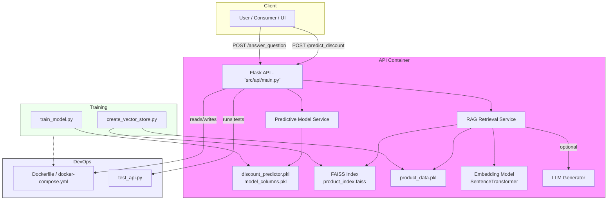

# System Architecture & Flow

This file contains a high-level architecture diagram (Mermaid) and explanation for the Marketing Data Intelligence system.

## Diagram (Mermaid)

## Notes

- The Flask API exposes two primary endpoints:
  - `/predict_discount` — loads `discount_predictor.pkl` and `model_columns.pkl` to produce a numeric discount prediction.
  - `/answer_question` — uses a RAG flow: query -> embedding -> FAISS search -> retrieve product data -> (optional) LLM generation.

- Training scripts produce the model artifacts and vector store:
  - `src/scripts/train_model.py` → trains the discount model and writes `discount_predictor.pkl`, `model_columns.pkl`.
  - `src/scripts/create_vector_store.py` → builds `product_index.faiss` and `product_data.pkl` used by RAG.

- Containerization & deployment:
  - `Dockerfile` and `docker-compose.yml` build and run the API, with pinned numeric libs and CPU-only ML wheels to ensure compatibility.
  - `.dockerignore` reduces build context.

- Testing & validation:
  - `test_api.py` acts as a simple integration test for both endpoints.
  - Add unit tests and load tests for production readiness.

## How to render

View this file on GitHub (Mermaid support) or use a local Markdown renderer that supports Mermaid. If your viewer doesn't render Mermaid, you can copy the diagram block into an online Mermaid live editor (https://mermaid.live) or convert it to an image using tools like VS Code Mermaid preview or `mmdc` (Mermaid CLI).
